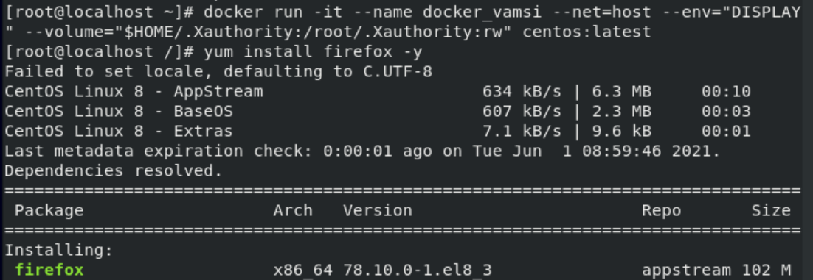

#  Graphical user interface (GUI) Container on Docker

## Task Description 📄
This task involves launching a container on Docker in GUI mode and running GUI software within the container. Specifically, I will demonstrate running applications like Firefox and Jupyter Notebook inside a Docker container.

## Architecture Diagram

Below is an architecture diagram illustrating the setup:


## Prerequisites
- Red Hat (RHEL8) Linux
- Docker installed on the OS

## Steps to Achieve the Task

### Step 1: Check if Docker is Installed
First, verify that Docker is installed on your system by running:
```
docker info
```


### Step 2: Pull the Docker Image
Pull the CentOS Docker image:
```
docker pull centos:latest
```


### Step 3: Run the Docker Container
Run the CentOS container:

```
docker run -it centos
yum install firefox -y
```
This confirms that the Docker container is running successfully.


After the installation of firefox. Now run the firefox

You can clearly see that it gives an error saying “no display environment variable specified“. So , So we require some display environment to run GUI applications. So we need to define $DISPLAY while launching container which i've done it in step 5.
### Step 4: Install GUI Applications in the Container
After running the container, install GUI applications like Firefox and Jupyter Notebook using the following commands:
```
yum install firefox -y
yum install python3 -y
pip3 install jupyter
```

### Step 5: Set Up Display Environment for GUI Applications
Running GUI applications directly in the container will result in an error due to the lack of a display environment. To resolve this, define the \$DISPLAY variable while launching the container:
```
docker run -it --name docker_vamsi --net=host --env="DISPLAY" --volume="$HOME/.Xauthority:/root/.Xauthority:rw" centos:latest
```
This command shares the host's XServer with the container by creating a volume and uses the host system's network for connectivity.

### Step 6: Launch Firefox
Run Firefox in the container:
```
firefox
```
Firefox should successfully launch. Ignore any non-critical installation package errors. Close the browser using \`CTRL+C\`.


### Step 7: Launch Jupyter Notebook
Install and launch Jupyter Notebook:
```
yum install python3 -y
pip3 install jupyter
jupyter notebook --allow-root
```


Congratulations! You have successfully launched Jupyter Notebook and Firefox in a Docker container. Similarly, you can run other GUI applications on top of the Docker container.
